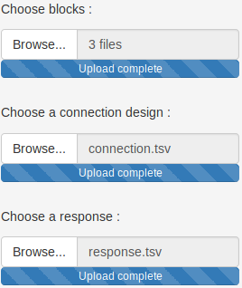
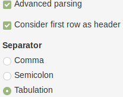
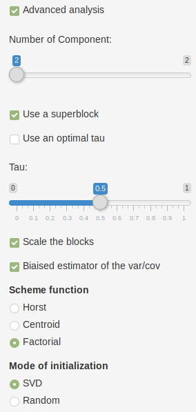

# TUTORIAL FOR RGCCA R-SHINY

##### Version: 1.0

##### Author: Etienne CAMENEN

##### Key-words: 
omics, RGCCA, multi-block

##### EDAM operation: 
analysis, correlation, visualisation

##### Contact: 
arthur.tenenhaus@l2s.centralesupelec.fr

##### Short description
Performs multi-variate analysis (PCA, CCA, PLS, RGCCA) and projects the variables and samples into a bi-dimensional space.

---

## Description

For the sake of comprehension of the use of the RGCCA package, the theoretical foundations of RGCCA and variations - 
that were previously published (Tenenhaus and Tenenhaus 2011 ; Tenenhaus and Tenenhaus 2014 ; Tenenhaus, and Frouin 2015 ;
Tenenhaus, Tenenhaus, and Groenen 2017).

We consider J data matrices *X1, ..., XJ*. Each *n × pj* data matrix *Xj = [ xj1, ..., xjpj ]* is called a block and represents 
a set of *pj* variables observed on *n* individuals.
The number and the nature of the variables may differ from one block to another, but the individuals must be the same across blocks.
We assume that all variables are centered. The objective of RGCCA is to find, for each block, a weighted composite of 
variables (called block component) *yj = Xj * aj, j=1, ... , J* (where *aj* is a column-vector with  *pj* elements) 
summarizing the relevant information between and within the blocks.
The block components are obtained such that (i) block components explain well their own block and/or (ii) 
block components that are assumed to be connected are highly correlated. 
In addition, RGCCA integrates a variable selection procedure, called SGCCA, allowing the identification of the most 
relevant features. Finally, as a component-based method, RGCCA/SGCCA can provide users with graphical 
representations to visualize the sources of variability within blocks and the amount of correlation between blocks.

## Load the inputs

Download the pre-formatted files [here](https://github.com/BrainAndSpineInstitute/rgcca_Rpackage/tree/master/data). This folder includes three blocks with the same individuals (corresponding to the countries here) but different
types of variables (agriculture, industry and politic). According to Russett (1964), a high agriculture inequality
and a low industrial development lead to unstable political regime. 
Load the three blocks ```agriculture.tsv```, ```industry.tsv``` and ```politic.tsv``` in the left panel (**Fig. 1**).

When the blocks are loaded, the analysis is automatically run. To directly visualize the outputs, see the last section of this tutorial.

This ```data/``` folder also contains a symmetric matrix (```connection.tsv```) corresponding to the relationship
between each block : 1 if two blocks are connected, 0 otherwise. This file allows to add *a priori* information 
of correlation hypothesis between the blocks to calibrate the model. Load this file into the corresponding box and observe
the result on the plots. By default, connected to each other, but they are all connected to a “superblock”, the concatenation matrix
of the blocks. This superblock is used to visualize the data of all the blocks together in a common space. 
By connecting the agriculture and the industry blocks only to the politic block, ```connection.tsv```
file do not use a superblock and consider the first two blocks as predictors and the last one as a response.
A qualitative or quantitative variable could also be added to color the samples according to different group of responses
in the sample plot. Load the ```response.tsv``` file in the corresponding box to load a new plot.


 
*Fig. 1 : File loading panel (on the top left). The first box is used to load the blocks, the second one, to load the 
connection file, and the last one, to load the response file.*

##  Parsing parameters

By default, except for the connection, the first line of the file is considered as a header. By rolling down the advanced
parsing mode, disable this parameter (**Fig. 2**). The plot is not updated because of an error caugth in the R-code ("The first line does
not have a row name"). The character used to separate the column is the tabulation. Change the separator to an other one
to observe an error catching ("politic block file has an only-column. Check the separator [by default: tabulation].").


 
*Fig. 2 : Settings menu for parsing advanced mode, after activating the checkbox, header and column separator parameters
could be customized*

## Analysis parameters

RGCCA is automatically run with all default parameters set by its associated R-library. By example, the optimal value of tau
is automatically set to each block (**Fig. 3**). One could make tau varying from 1 (maximize the correlation between blocks) to 0 (maximize 
the covariance between the variables of each block). RGCCA algorithm is based on a biased estimator of the variance (Sn). The unbiased
estimator (Sn-1) could be preferred by disabling this option. Similarly, the algorithm scales each block to zero mean and unit
variances and then divide them by the square root of its number of variables. If the data are already scaled, this step could
be avoided by selecting the parameter.


 
*Fig. 3 : The second advanced panel shows various options to customize the RGCCA : disabling the superblock, the scaling
or the use of a biased variance estimator, chose another tau shrinkage parameters, another scheme function or another 
initialization mode*
 
## Graphical parameters

The graphics are projected in the "superbloc" space (i.e., the concatenation of all blocs) to visualize all the blocs together. 
Choose another block (e.g., "agriculture") to update the plots with your selection (**Fig. 4**). Similarly, the component used in X-axis
in the biplots the one used in histograms and the component used in Y-axis in biplots are respectively set on the first 
and the second components. The number maximum of component to select in graphics is set dynamically by the number of 
components selected in the analysis (defined in the last section). If the number of components in RGCCA is greater than 
three (it is not allowed in the Russet example), one could set for example the visualized axis to 1 for the X-axis in biplots
and 3 for Y-axis. The number of potential biomarkers is also set dynamically : the maximum corresponds to the sum of the variables
in all the blocks.
 


*Fig. 4 : On the last advanced panel, additional graphic options include the selected block and the components visualized in the 
plots and the maximum number of markers to print*

## Visualize the plots

By navigating between the tabs, the user could visualize the output of the analysis in various format. 
For each axis of the block, the corresponding percent of average explained variance is indicated.
The first tab is the projection of individuals coordinates in the selected component of the analysis, by default, on the
superblock (a concatenation of all the blocks) (**Fig. 5**). If a ```response``` file is loaded, each samples is colored according to
this group of responses.


*Fig. 5 : Samples coordinates on the two first components for the superblock of the RGCCA*

The second one corresponds to the Pearson correlation between the variables of the block and the
selected components in the analysis (by default, the two first one) (**Fig. 6**).
For this plot and the next one, if the superblock is selected for each variable, their belonging to each block is 
illustrated by groups of color.


*Fig. 6 : Correlation between each variable of each block (by using the superblock) and the two first components of RGCCA*

The next tab represents the weight of each variable ordered decreasingly on the RGCCA component selected in X-axis (1, by default) 
and for the selected block (superblock, by default) (**Fig. 7**). The top potential biomarkers are in the top. Their number is set by the graphical 
associated parameter.


*Fig. 7 : Top potential biomarkers among all the blocks with higher weight for the first component of RGCCA*

In the last one, the average variance explained of each variable in the selected block is ordered decreasingly (**Fig. 8**).


*Fig. 8 : Average variance explained in the first component of the superblock*

## References

Russett B.M., 1964. Inequality and Instability: The Relation of Land Tenure to Politics, World Politics 16:3, 442-454.

Tenenhaus, A., and M. Tenenhaus. 2011. “Regularized Generalized Canonical Correlation Analysis.” Psychometrika
76: 257–84.

———. 2014. “Regularized Generalized Canonical Correlation Analysis for multiblock or multigroup data analysis.”
European Journal of Operational Research 238: 391–403.

Tenenhaus, Arthur, Cathy Philippe, and Vincent Frouin. 2015. “Kernel Generalized Canonical Correlation Analysis.”
Computational Statistics & Data Analysis 90. Elsevier: 114–31.

Tenenhaus, M., A. Tenenhaus, and PJF. Groenen. 2017. “Regularized generalized canonical correlation analysis: A
framework for sequential multiblock component methods.” Psychometrika, in press