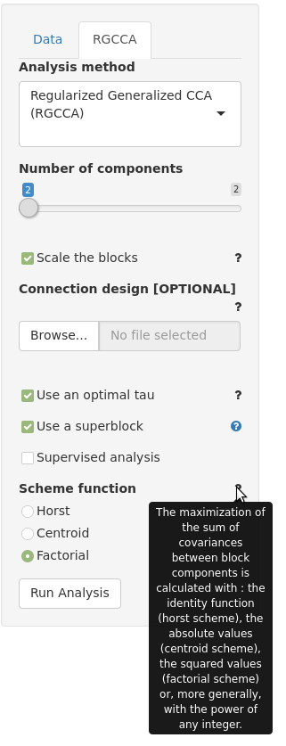
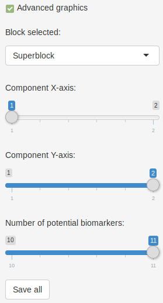
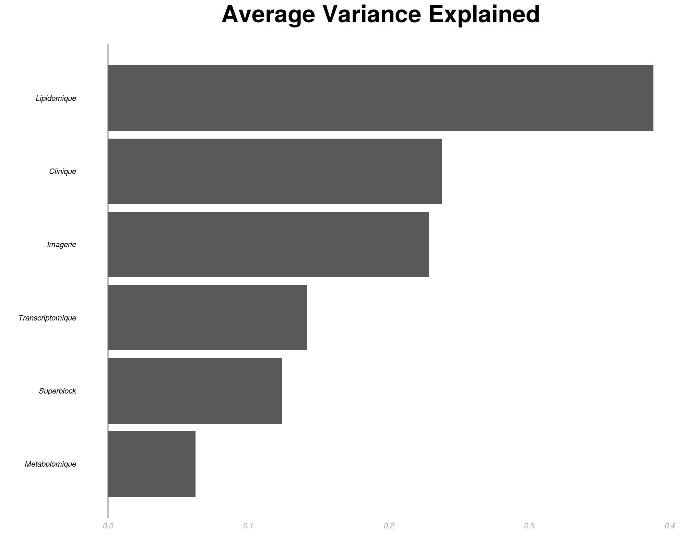

# TUTORIAL FOR RGCCA R-SHINY

##### Version: 1.0

##### Author: Etienne CAMENEN

##### Key-words: 
omics, RGCCA, multi-block

##### EDAM operation: 
analysis, correlation, visualisation

##### Contact: 
arthur.tenenhaus@l2s.centralesupelec.fr

##### Short description
Performs multi-variate analysis (PCA, CCA, PLS, RGCCA) and projects the variables and samples into a bi-dimensional space.

---


## Description


For the sake of comprehension of the use of the RGCCA package, the theoretical foundations of RGCCA and variations - 
that were previously published (Tenenhaus and Tenenhaus 2011 ; Tenenhaus and Tenenhaus 2014 ; Tenenhaus, and Frouin 2015 ;
Tenenhaus, Tenenhaus, and Groenen 2017).

We consider J data matrices *X1, ..., XJ*. Each *n × pj* data matrix *Xj = [ xj1, ..., xjpj ]* is called a block and represents 
a set of *pj* variables observed on *n* individuals.
The number and the nature of the variables may differ from one block to another, but the individuals must be the same across blocks.
We assume that all variables are centered. The objective of RGCCA is to find, for each block, a weighted composite of 
variables (called block component) *yj = Xj * aj, j=1, ... , J* (where *aj* is a column-vector with  *pj* elements) 
summarizing the relevant information between and within the blocks.
The block components are obtained such that (i) block components explain well their own block and/or (ii) 
block components that are assumed to be connected are highly correlated. 
In addition, RGCCA integrates a variable selection procedure, called SGCCA, allowing the identification of the most 
relevant features. Finally, as a component-based method, RGCCA/SGCCA can provide users with graphical 
representations to visualize the sources of variability within blocks and the amount of correlation between blocks.


## Load the inputs ('Data' tab)


Download the pre-formatted files [here](https://github.com/BrainAndSpineInstitute/rgcca_Rpackage/tree/master/data). 
This folder includes three blocks with the same individuals (corresponding to the countries here) but different
types of variables (agriculture, industry and politic). According to Russett (1964), a high agriculture inequality
and a low industrial development lead to unstable political regime. 
Load the three blocks ```agriculture.tsv```, ```industry.tsv``` and ```politic.tsv``` in the ```blocks``` box (**Fig. 1**) 
(CTRL + click for multiple selection). The accepted format is one (for PCA) or multiple CSV files containing a matrix
 with :
- quantitative values only, with decimal separated by '.' and missing values labelled as "NA"
- samples in lines, labelled in the 1rst column with the same sample names between blocks (some samples could be missing in some
 blocks)
- variables in columns, labelled in the 1rst column without duplications in variable names between blocks

This format recommendation could be viewed with **an overmouse on the question mark** on the right of the file loading box.

By default, the character used in ```column separator``` parameter is the ```tabulation```. Change the separator to another one
(e.g.,```Semicolon```) to observe an error notification : 
> "politic block file has an only-column. Check the separator."


 
*Fig. 1 : File loading panel (on the top right). The first box is used to load the blocks, the second one, to load the 
connection file, and the last one, to select the column separator.*


## Analysis parameters ('RGCCA' tab)


#### Analysis methods

After loading the data, a ```RGCCA``` tab will appear for an analyse. By default, the selected ```analysis method``` is set on ```RGCCA```. 
Another methods could be selected. When only one block file is loaded in the previous step, a ```PCA``` will be performed. 
By using two blocks, the interface will allow to select two-blocks analysis method (```PLS``` is selected by default). 

The other analyse parameters are all set by default and the user could directly click on the ```run analysis``` 
button. To directly visualize the outputs, see the last section of this tutorial.

#### Number of components and scaling

With all analysis method, the ```number of components``` could be changed. By default, it is set to two components (for biplots)
and the maximum of components allowed is the minimum number of column between all dataset. In the case of Russet
data, two components are allowed because of the two columns in the industry block. Five components is the maximum value
allowed. 
 
One could also ```scale [/ unscale] the blocks```. A zero means translation is always performed. If the parameter is
selected, each block is standardized to unit variances and then divided by the square root of its number of variables.
If the data are already scaled, this step could
be avoided by disabling it.

Other parameters are only accessible with R/SGCCA.


#### Connection between blocks


###### Loading a connection file

The downloaded ```data/``` folder contains a symmetric matrix (```connection.tsv```) corresponding to the relationship
between each block : 1 if two blocks are connected, 0 otherwise. The expected format should be tabulation-separated and
do not have column and row names. This file allows to add *a priori* information of correlation hypothesis between the 
blocks. This file is not taken in account with a superblock (Cf. corresponding section). After disabling the 
```Use a superblock``` option, load this file into the  ```Connection design``` file box and observe the result on the 
plots. This file contains 1 in all non-diagonal cells and make the assumption that all the blocks are connected together.

###### Superblock 
By default, all the blocks are connected to a superblock, a concatenation of all the other blocks. 
This superblock is used to visualize the data of all the blocks together in a common space. To visualize the blocks 
without the superblock, disable the ```Use a superblock``` option.

###### Supervised analysis
By selecting ```supervised analysis``` option, a drop-down menu appear to select the block to predict. By selecting this
block, all other blocks (predictors) will be only connected to this (response) block. For example, select the 
```agriculture``` block to consider it as the response.

If a superblock is used, supervised analysis is automatically disabled, and inversely.

#### Other R/SGCCA parameters

###### Shrinkage parameter (Tau)
By selecting a RGCCA,```Use an optimal tau``` is automatically set for each block (**Fig. 3**). When disabled, one could make ```tau``` varying
for each block from 1 (maximize the correlation between the variables of the selected block) to 0 (maximize the covariance).
 
###### Sparsity coefficient
By selecting a SGCCA, ``` Sparsity``` could be applied to each blocks. This coefficient vary from the inverse of the
square root of the number of column of each block (the smaller set of variables) to 1 (all the variables are included). 
Moove the cursor for the first block to a 0.4 sparsity coefficient to produce an error :
> "Sparsity parameter is equals to 0.4. For SGCCA, it must be comprise between 1/sqrt(number_column) (i.e., 0.41, 0.71, 0.58, 0.31) and 1."

Move again the cursor on a upper spasity value to make it works again.
 
###### Scheme function (advanced users)
```Scheme function``` allows to select the link function for the maximization of the sum of covariances between block 
components among : 
- identity (```Horst```)
- absolute values (```centroid```)
- squared values (```factorial```)
          

 
*Fig. 2 : The second parameter panel shows various options to customize the analysis : choose the analysis, 
choose the number of components, scale the blocks, choose a shrinkage, use the superblock or a supervised approach, 
choose a link function*
 
## Graphical parameters

On the sample plot tab, in the right panel (see next section for more information about this plot), one could select
a qualitative or a quantitative variable to color the samples according to different group of responses. 
For this, load the ```response.tsv``` file in the corresponding ```Groups of modalities``` box to load a new plot.

The graphics are projected in the "superblock" space (i.e., the concatenation of all blocs) to visualize all the blocs together. 
Choose another block (e.g., "agriculture") to update the plots with your selection (**Fig. 3**). Similarly, the component used in X-axis
in the biplots the one used in histograms and the component used in Y-axis in biplots are respectively set on the first 
and the second components. The number maximum of component to select in graphics is set dynamically by the number of 
components selected in the analysis (defined in the last section). If the number of components in RGCCA is greater than 
three (it is not allowed in the Russet example), one could set for example the visualized axis to 1 for the X-axis in biplots
and 3 for Y-axis. The number of potential biomarkers is also set dynamically : the maximum corresponds to the sum of the variables
in all the blocks.
 


*Fig. 3 : On the last advanced panel, additional graphic options include the selected block and the components visualized in the 
plots and the maximum number of markers to print*

## Visualize the plots

By navigating between the tabs, the user could visualize the output of the analysis in various format. 
For each axis of the block, the corresponding percent of average explained variance is indicated.
The first tab is the projection of individuals coordinates in the selected component of the analysis, by default, on the
superblock (a concatenation of all the blocks) (**Fig. 5**). If a ```response``` file is loaded, each samples is colored according to
this group of responses.


*Fig. 5 : Samples coordinates on the two first components for the superblock of the RGCCA*

The second one corresponds to the Pearson correlation between the variables of the block and the
selected components in the analysis (by default, the two first one) (**Fig. 6**).
For this plot and the next one, if the superblock is selected for each variable, their belonging to each block is 
illustrated by groups of color.


*Fig. 6 : Correlation between each variable of each block (by using the superblock) and the two first components of RGCCA*

The next tab represents the weight of each variable ordered decreasingly on the RGCCA component selected in X-axis (1, by default) 
and for the selected block (superblock, by default) (**Fig. 7**). The top potential biomarkers are in the top. Their number is set by the graphical 
associated parameter.


*Fig. 7 : Top potential biomarkers among all the blocks with higher weight for the first component of RGCCA*

In the last one, the average variance explained of each variable in the selected block is ordered decreasingly (**Fig. 8**).


*Fig. 8 : Average variance explained in the first component of the superblock*

## References

Russett B.M., 1964. Inequality and Instability: The Relation of Land Tenure to Politics, World Politics 16:3, 442-454.

Tenenhaus, A., and M. Tenenhaus. 2011. “Regularized Generalized Canonical Correlation Analysis.” Psychometrika
76: 257–84.

———. 2014. “Regularized Generalized Canonical Correlation Analysis for multiblock or multigroup data analysis.”
European Journal of Operational Research 238: 391–403.

Tenenhaus, Arthur, Cathy Philippe, and Vincent Frouin. 2015. “Kernel Generalized Canonical Correlation Analysis.”
Computational Statistics & Data Analysis 90. Elsevier: 114–31.

Tenenhaus, M., A. Tenenhaus, and PJF. Groenen. 2017. “Regularized generalized canonical correlation analysis: A
framework for sequential multiblock component methods.” Psychometrika, in press